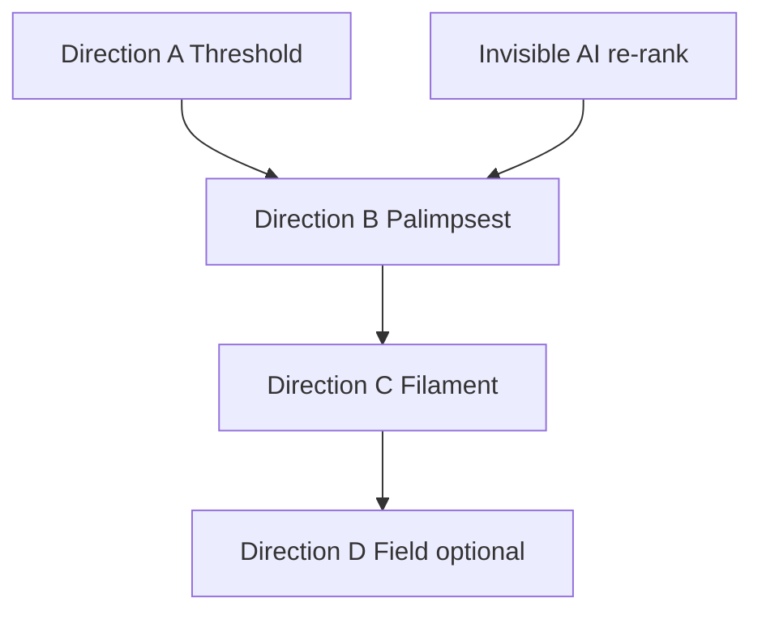

# Echo — Cognitive Continuity Design Exploration

Product design record for Echo as a **calm cognitive continuity environment** (not a feed, archive, or AI surface). Implementation status and code pointers live in [`spatial-navigation.md`](spatial-navigation.md).

**2026-07 update:** Horizontal `StreamEchoPager` and alternate vessels (threshold, palimpsest, field, filament) were **removed**. Production Echo is **home depth recall** — one [`EchoRecallCardVessel`](../components/echo/EchoRecallCardVessel.tsx) under the composer via [`HomeDepthRecall`](../components/HomeDepthRecall.tsx). Selection and continuity prefs unchanged.

**Shipped UI direction (historical):** **A — Threshold Echo** on pager — superseded by home depth strip.  
**Dogfood shortlist (Phase 1):** **1I Threshold**, **1H Palimpsest**, **1F Orbit-without-diagram** — B and F deferred behind calm metrics.

**Lead dogfood direction (team):** **B Palimpsest** — one full card + age rims, peel without stack clutter; strongest continuity read so far. Threshold stays production default until ship criteria met.

---

## Phase 0 baseline (historical — pager removed 2026-07)

| Layer | Implementation |
|-------|----------------|
| Navigation | ~~`StreamEchoPager`~~ → home depth strip under composer |
| Selection | [`selectEchoCandidates`](../utils/selectEchoCandidates.ts) — gravity + drift + continuity signals |
| Surface | [`EchoRecallCardVessel`](../components/echo/EchoRecallCardVessel.tsx) via [`HomeDepthRecall`](../components/HomeDepthRecall.tsx) |
| Gates | [`constants/echoLayer.ts`](../constants/echoLayer.ts), [`echoLayerVisibility`](../utils/echoLayerVisibility.ts) |

---

## Phase 1 — Interaction concepts (1A–1I)

| ID | Model | Verdict |
|----|--------|---------|
| **1A** | Continuity field (gravity wells) | Dogfood later — **D** |
| **1B** | Archaeological strata | Deferred — calendar risk |
| **1C** | Dusk room (light = era) | Partial — wash crossfade exists |
| **1D** | Pulse resurfacing (single breath) | Future variant of Threshold |
| **1E** | Fog of almost-remembering | Future — a11y via opacity not blur-only |
| **1F** | Orbit without diagram | **Dropped from Palimpsest** — unreadable without explanation; peel deck carries continuity |
| **1G** | Unfinished filament | Future — needs thread builder |
| **1H** | Palimpsest stack | **Dogfood shortlist** — Direction B |
| **1I** | Threshold doorway | **Shipped** — Direction A |

**Shortlist for dogfood:** 1I (now), 1H (peel deck), 1F (anchor + satellites). Do not add horizontal pages or tabs.

---

## Phase 2 — Emotional UX language

| Dimension | Echo register |
|-----------|----------------|
| **Pacing** | Slower than stream; no Echo-page scroll; content fades after atmosphere via [`echoPagerMotion`](../utils/echoPagerMotion.ts) + [`EchoLayer`](../components/echo/EchoLayer.tsx) |
| **Transitions** | Stream ↔ plum wash via [`EchoSpatialBackground`](../components/echo/EchoSpatialBackground.tsx); threshold parallax on swipe; sheet dismiss returns to **stream home** |
| **Movement** | Ease-out settle; edge peek only — no autoplay carousel |
| **Density** | 1 primary + 2 ghosts (max pool still ≤7 for scoring) |
| **Visual silence** | No kicker/caption explaining the feature; relative age + accent dot only |
| **Depth** | Wash → ghosts → primary → sheet |
| **Clarity vs mystery** | Tap opens full text; **never** why-this-now copy |

**Tone:** *Something returned.* — not *Here are your memories.*

---

## Phase 3 — Continuity mechanics

All **local-only**, no capture-time decisions.

| Mechanic | Module | Behavior |
|----------|--------|----------|
| Stem recurrence | [`echoStems`](../utils/echoStems.ts) | Boost gravity when shared stem across entries ≥7 days apart; ≤1 recurrence slot |
| Unfinished ideas | [`echoContinuitySignals`](../utils/echoContinuitySignals.ts) | `...`, `?`, reopen-without-edit boosts; drives interruption primary |
| Echo cooldown | [`echoLayerPrefs`](../storage/echoLayerPrefs.ts) | Entry hidden from Echo 14 days after last display |
| Seasonal salt | [`selectEchoCandidates`](../utils/selectEchoCandidates.ts) | Week-of-year in shuffle tail |
| Session thread | [`echoLayerPrefs`](../storage/echoLayerPrefs.ts) | Last opened entry; neighbors ±2h promoted to primary |
| Interruption recovery | [`getEchoInterruptionPrimaryId`](../utils/echoContinuitySignals.ts) | Edge peek + primary bias after 20+ min away |
| Lexical / link mass | [`echoContinuitySignals`](../utils/echoContinuitySignals.ts) | Silent gravity dimensions |
| Emotional recurrence | [`echoEmotionalAtmosphere`](../utils/echoEmotionalAtmosphere.ts) | Ghost trace opacity from text proxies only |

Display recording: [`recordEchoCandidatesDisplayed`](../storage/echoLayerPrefs.ts) on `echo_layer_revealed`.

---

## Phase 4 — Invisible AI boundaries

See [`echoAiRerank.ts`](../utils/echoAiRerank.ts) and `ECHO_AI_RERANK_ENABLED` in [`constants/echoLayer.ts`](../constants/echoLayer.ts).

| AI may (invisibly) | AI must not |
|--------------------|-------------|
| Re-rank within fixed ≤7 slots | Summarize or explain in UI |
| Time edge peek / suppress during capture streaks | Chat, coach, psychoanalyze |
| Assemble future filaments (1G) | Increase slot count |
| Adjust pacing from dwell (future) | Become visible “insights” |

**Posture:** Phase A = deterministic (`selectEchoCandidates`). Phase B = on-device re-rank hook with **fallback to Phase A order**. Phase C = optional precomputed affinity ids from desktop — still no graph UI.

**Guardrail:** If re-rank fails or flag is off, user sees deterministic gravity/drift — slightly less magic, not broken.

---

## Phase 5 — UI directions and sequencing

| Direction | Status |
|-----------|--------|
| **A Threshold** | **Shipped** |
| **B Palimpsest** | **Lead dogfood** — peel deck only (3 cards); dev default in `__DEV__` |
| **C Filament** | Dev dogfood — [`EchoFilamentVessel`](../components/echo/EchoFilamentVessel.tsx) + [`echoFilament`](../utils/echoFilament.ts) |
| **D Field** | Dev dogfood — [`EchoFieldVessel`](../components/echo/EchoFieldVessel.tsx); tap to focus, tap again to open; no pan (avoids pager fight) |

---

## Palimpsest ship criteria (replace Threshold)

| Criterion | Target |
|-----------|--------|
| Peel gesture | Vertical drag commits without fighting stream pager; reduce-motion long-press fallback |
| Readability | One full card + age rims; no extra ghosts outside the peel deck |
| Continuity | `buildEchoCandidates` gravity/drift order preserved; peel rotates deck only |
| Silence | No labels for gravity/drift/orbit; accent dot + age only |
| Friction | No Echo-page scroll; sheet dismiss returns to stream home |
| Dogfood | Several sessions without “archive” or “feed” read |

Flip `ECHO_UI_VARIANT_SHIPPED` / `ECHO_PALIMPSEST_ENABLED` only after the above holds in real use.

---

## Motion and surface registers

| Register | Pacing | Expression |
|----------|--------|------------|
| **Capture + stream** | Fast, low decisions | Composer flat on ambient; stream rows full-bleed (no card feed); viewport focus = attention, not ranking |
| **Echo** | Slower than stream | Wash before content; no Echo-page scroll; peel (Palimpsest) or threshold ghosts; no “why this” copy |

**Shared motion scale:** [`constants/motion.ts`](../constants/motion.ts) — `capture` / `stream` / `echo` tiers (ms). Stream focus, echo pager, sheet enter, and empty-state hints pull from one scale.

**Chrome discipline:**
- **Composer** — typography on ambient, not a boxed capsule beside search.
- **Search** — glass pill when stream has rows (secondary).
- **Stream rows** — flat; press = animated shade only.
- **Echo vessels** — fragment radius on cards only (Palimpsest / Threshold).

**Out of bounds for Echo/capture:** mood scales, check-in rituals, streaks, explanatory recall copy, second horizontal tabs, card-based stream.

---

## Hard constraints

- Stream + fixed composer default on cold open
- One horizontal Echo page; swipe right = Echo, swipe left on row = delete
- No folders/tags/graphs/streaks/AI chrome
- No “why you’re seeing this”
- Engagement not synced to desktop

---

## Changelog

| Date | Note |
|------|------|
| 2026-05-25 | Exploration doc; Direction A Threshold UI; continuity mechanics + AI boundary stub |
| 2026-05-25 | Fix `echoPagerMotion` monotonic inputRange; Direction B palimpsest behind dev toggle |
| 2026-05-25 | Direction C filament + dev menu UI cycle; emotional veil on [`EchoSpatialBackground`](../components/echo/EchoSpatialBackground.tsx) |
| 2026-05-25 | Direction D field (dev); dev default **palimpsest**; menu cycle threshold → palimpsest → filament → field |
| 2026-05-25 | Product: **Palimpsest** recorded as lead dogfood direction (Threshold remains shipped) |
| 2026-05-25 | **1F orbit** tried in Palimpsest, removed (no clear meaning); peel reset on pool change; ship criteria table |
| 2026-05-25 | Palimpsest refinement P0–P2: rim excerpts, temporal whisper, soft card, peel motion + haptics |
| 2026-05-25 | Echo P0 pacing: `echoWashPresence` leads content; composer dim holds to 65% swipe; asymmetric pager reveal; recall dim out delay; peel resist 30px + Soft haptic; echo sheet scrim leads content |
| 2026-05-25 | P1–P2: presence settle on Echo land; ghost trace excerpts; optical lift; edge peek repeat every 7d (skip while typing) |
| 2026-05-25 | P3: 21d Echo display cooldown when opened ≥2× without edit; dwell rerank flag stub |
| 2026-05-25 | Main stream: slower focus cross-fade (280ms), section/row breathing room, soft row press, stream sheet content lag |
| 2026-05-25 | `constants/motion.ts`; calmer empty-hint timing; motion/surface register notes (composer shell tried, reverted — fights search pill) |
| 2026-05-25 | Behavior pass B1–B5: trace rims, peel resistance, press settle, echo sheet enter + recall dim |
